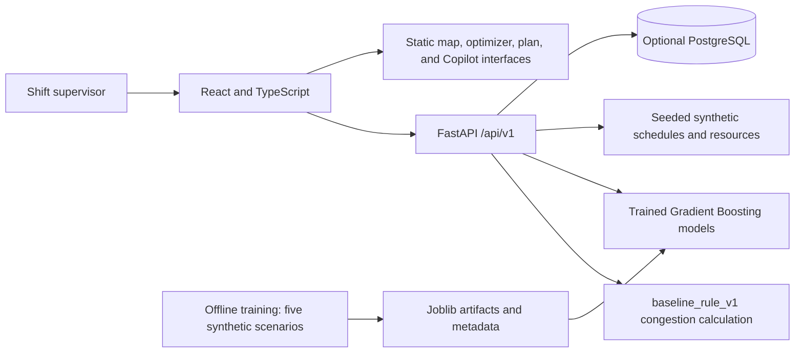

# Architecture

## Current implementation

| Component | Technology | Implemented responsibility |
|---|---|---|
| Frontend | React, TypeScript, Vite, Tailwind | Dashboard, scenario selection, prediction requests, demo planning pages |
| API | FastAPI, Pydantic | Input validation, dashboard/resources/scenarios endpoints, prediction inference |
| Baseline engine | Python deterministic rules | Twelve six-hour windows with demand, capacity, and compatibility drivers |
| ML pipeline | scikit-learn Gradient Boosting, joblib, NumPy | Offline training and runtime waiting-time/congestion inference |
| Data | Seeded Python generator, SQLAlchemy, Alembic | Synthetic fallback, schema, and optional PostgreSQL seed/migrations |
| Quality | Pytest, Vitest, TypeScript, GitHub Actions | App checks and unchanged official submission validator |

## Working end-to-end flow

1. The supervisor opens the dashboard. The browser requests summary, congestion, schedules, resources, and scenarios.
2. FastAPI reads seeded data from PostgreSQL when available, otherwise generates deterministic synthetic data.
3. The dashboard baseline engine calculates capacity pressure and risk buckets. Selecting a scenario recalculates that derived view without persisting the selection.
4. On Congestion & Wait, the user selects a schedule or forecast window and submits a prediction request.
5. The service constructs model features and calls the serialized trained model. The API returns actual inference output with model/data labels and contextual explanation factors.
6. React displays waiting time or congestion slots. Missing model artifacts return HTTP 503 rather than fabricated predictions.

## Planned modules and current limits

OR-Tools scheduling, alternate-port cost comparison, persisted plan generation/approval, and live IBM Bob MCP tools are not implemented. The optimizer, map, operations-plan, and Copilot interfaces use demonstration content. Plan confirmation changes browser state only. Copilot responses are predefined; no live LLM is connected. Explanation factors and displayed confidence are not a validated production uncertainty analysis.

## Security and scalability

Environment examples contain dummy development values; real `.env`, dependencies, and build caches are ignored. API input validation and CORS are configured. This is a local single-terminal prototype without production authentication or operational dispatch. The optional database check targets localhost:5432; remote database discovery is not validated. Larger workloads, model calibration, and production deployment require separate testing.
