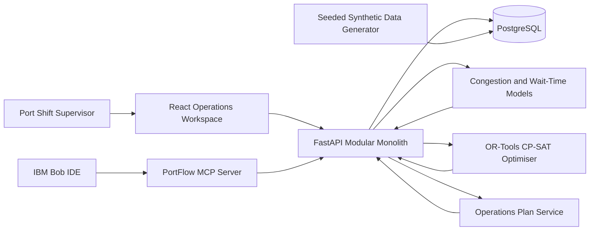

# Architecture

## System Diagram

## Components

| Component | Technology | Responsibility |
|---|---|---|
| Operations workspace | React, TypeScript, Vite, Tailwind CSS | Dashboard, schedules, risk explanations, optimiser review, plan approval |
| Application API | FastAPI, Pydantic | Validation, orchestration, stable `/api/v1` contract, error handling |
| Persistence | PostgreSQL, SQLAlchemy 2, Alembic | Operational records, immutable prediction and optimisation snapshots |
| Prediction | Python ML pipeline | Congestion probability and vessel waiting-time inference |
| Optimisation | OR-Tools CP-SAT | Joint feasible berth-and-crane scheduling |
| IBM Bob integration | Bob IDE task history and MCP server | Build evidence plus contextual, read-oriented operational explanations |
| Quality pipeline | Pytest, TypeScript, GitHub Actions | Application tests and official submission validation |

## End-to-End Data Flow

1. A schedule is entered manually or imported from a validated CSV file.
2. The API normalises timestamps to UTC and persists the operational inputs.
3. The prediction service produces a versioned probability, risk level, waiting-time estimate, and feature snapshot.
4. The optimisation service receives the same schedule plus berth/crane constraints and returns the best feasible plan within a bounded solve time.
5. The API persists the optimiser input snapshot, assignments, objective breakdown, and solver status.
6. The UI compares the proposal with the baseline and asks the supervisor for explicit approval.
7. IBM Bob can query safe MCP tools for explanations and summaries; it cannot approve or execute operational changes.

## Security and Reliability

- Secrets are provided only through environment variables and never committed.
- The public repository contains `.env.example` files with non-secret development values.
- Database credentials are not logged.
- Pydantic validates API inputs; database constraints protect core invariants.
- Consequential actions require explicit human confirmation.
- Versioned model, feature, and optimiser snapshots keep recommendations reproducible.

## MVP Scalability

The hackathon build is a modular monolith for one terminal. The solver uses a 30-minute planning grid and a strict time limit, which is sufficient for the small demonstration scenario. The architecture deliberately avoids microservices, Kafka, and Kubernetes because they add operational complexity without improving the proof of concept.
